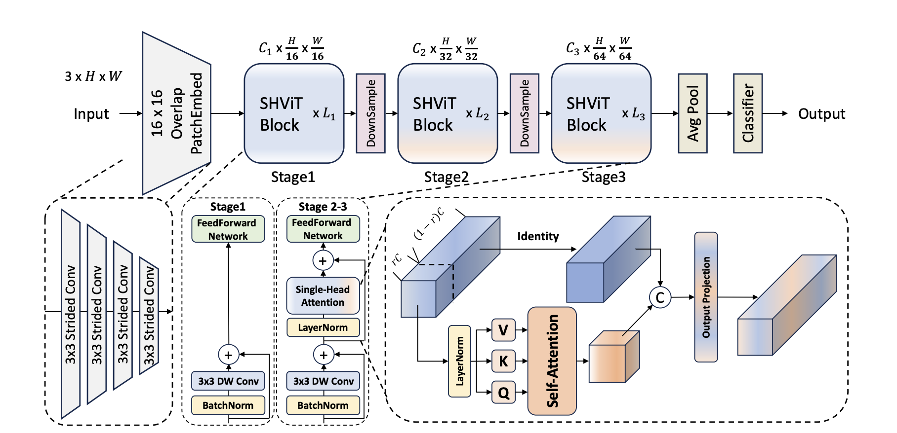

> [!NOTE]
> This is a fake github account and dummy gmail account accociated with name Jacob Schib. The code is provided for verification purpose as double blind submission.\*\*

# SHViT-Reimplementation

This repository provides a refactored implementation of the SHViT (Single-Head Vision Transformer) model, originally presented in the CVPR 2024 paper "[SHViT: Single-Head Vision Transformer with Memory Efficient Macro Design](https://arxiv.org/abs/2311.11315)".

This version focuses on:

- Configuration-driven model building using Python dataclasses.
- Integration with the `timm` library for model registration and creation.
- Separated scripts for training (`train.py`) and evaluation (`evaluate.py`).
- Support for loading local checkpoints.

## Features

- SHViT architecture implementation (currently supporting S1, S2 variants).
- Model configuration managed via `model/model_configs.py`.
- Easy registration of custom model variants using `timm`.
- Standard training and evaluation pipelines adapted from popular `timm`-based projects.
- Distributed training and evaluation support using `torchrun`.
- Model EMA (Exponential Moving Average).
- Standard data augmentations (including RandAugment, Mixup, CutMix, Random Erasing) via `timm`.
- Ability to load pretrained weights from URLs or local file paths.
- Layer fusion support via a `model.fuse()` method for potentially faster inference.

<details>
  <summary>
  <font size="+1">Abstract</font>
  </summary>
 High computational costs remain a significant barrier to deploying Vision Transformers (ViTs) in resource-constrained applications. This paper investigates the Single-Head Vision Transformer (SHViT) , an architecture designed for efficiency through a macro-level convolutional stem and a micro-level partial Single-Head Self-Attention (SHSA) mechanism. We present a reimplementation and analysis of the SHViT-S1 and S2 variants. While our implementation successfully replicates the original parameter counts, benchmarking on ImageNet-1k revealed significant discrepancies compared to the original report; our SHViT-S1 achieved 69.6\% Top-1 accuracy with approximately 11k images/sec throughput on an NVIDIA RTX 3060, notably lower than the originally published accuracy and differing significantly in calculated FLOPs. Enhancements explored included the addition of a token pruning method. Furthermore, sensitivity analysis on the SHSA partial ratio and an ablation study on the convolutional stem depth provided insights generally supporting the rationale behind these specific design choices. This work offers a practical baseline on accessible hardware, a critical analysis highlighting performance replication challenges, and insights into SHViT's design trade-offs.
</details>

## Video Demonstration and Explanation

Please click on the thumbnail below to view the video on YouTube or click [here](https://youtu.be/WtfPZht9YxA).

[](https://youtu.be/WtfPZht9YxA)

## Pretrained Weights

|            name             | resolution | acc  |                                             model                                              |
| :-------------------------: | :--------: | :--: | :--------------------------------------------------------------------------------------------: |
|          SHViT-S1           |  224x224   | 72.8 | [model](https://drive.google.com/file/d/11CdlRZO3rA9vDkZ0U0TYC7ilFOELSTCq/view?usp=drive_link) |
|          SHViT-S2           |  224x224   | 75.2 | [model](https://drive.google.com/file/d/11Dux0vK3puFgn-49IXxg6WsK_RZmA5XQ/view?usp=drive_link) |
| SHViT-iPhone-exported_model |  224x224   | 77.4 | [model](https://drive.google.com/drive/folders/1nmeeAJaGw7gnOTMT2x2c2jGlMiFE5Xym?usp=sharing)  |

## Setup

### Prerequisites

- Python 3.10+
- PyTorch 1.8+
- CUDA (Recommended for GPU acceleration)

### Installation

1.  **Clone the repository:**

    ```bash
    git clone https://github.com/jace4-fakeaccount/SHViT-Reimplementation.git
    cd SHViT-Reimplementation
    ```

2.  **Create a virtual environment (Recommended):**

    - Using Conda:
      ```bash
      conda create -n shvit python=3.10 -y
      conda activate shvit
      ```
    - Using venv:
      ```bash
      python -m venv venv
      source venv/bin/activate # Linux/macOS
      # venv\Scripts\activate # Windows
      ```

3.  **Install dependencies:**
    Install PyTorch according to your system/CUDA version from the [official website](https://pytorch.org/). Then, install other requirements:
    ```bash
    conda install cudatoolkit==12.1 pytorch torchvision torchaudio -c pytorch
    pip install -r requirements.txt
    ```

### Dataset Preparation

This implementation expects a standard ImageFolder structure for datasets like ImageNet:

## Data Download

- Download the ImageNet dataset from the official [ImageNet website](http://www.image-net.org/download-images) or use a script to download it. You can also use other datasets, but ensure they are structured similarly.
- Or, Download ImageNet-1K train/val dataset from academic torrents : [train link](https://academictorrents.com/details/a306397ccf9c2ead27155983c254227c0fd938e2), [val link](https://academictorrents.com/details/5d6d0df7ed81efd49ca99ea4737e0ae5e3a5f2e5)

## Unpacking and Maintaining Directory Structure

1. Assume you have downloaded the dataset and you have all files in the same directory.

```bash
└── base_dir
    ├── ILSVRC2012_img_train.tar
    ├── ILSVRC2012_img_val.tar
    ├── ImageNet_class_index.json
    └── ImageNet_val_label.txt
```

2. Unpack the dataset using the following command: `python unpack_imagenet.py `

3. Validate the ImageNet_Dir and datset using following command: `python check.py`

Note: Change the base_dir, target_dir, and ImageNet_dir in the above script as per your requirement.

4. The expected directory structure for the dataset is as follows:

```
dataset/
    train/
        class1/
            img1.jpg
            img2.jpg
            ...
        class2/
            img1.jpg
            img2.jpg
            ...
    val/
        class1/
            img1.jpg
            img2.jpg
            ...
        class2/
            img1.jpg
            img2.jpg
            ...
```

You can use the `torchvision.datasets.ImageFolder` class to load datasets in this format.
You can also use custom datasets by implementing a similar structure or using PyTorch's Dataset class.

## Usage

### Training

To train the model, you can use the following command:

- Single GPU training:

```bash
python --use_env main.py --model shvit_s1 --data-path /path/to/ImageNet --dist-eval --weight-decay 0.025
```

- Multi-GPU training:

```bash
python -m torch.distributed.launch --nproc_per_node=8 main.py --model shvit_s1 --data-path /path/to/ImageNet --dist-eval --weight-decay 0.025
```

### Evaluation

Example:

```bash

python main.py --eval --model shvit_s1 --resume checkpoint/shvit_s1.pth --data-path /path/to/ImageNet --input-size 256
```

### Testing

```bash
python test.py --model shvit_s1 --checkpoint checkpoint/shvit_s1.pth --image-path data/<image>.jpg --input-size 256 --download-lables
```

### Inference on iPhone

## Export the model

```bash
python src/export.py --variant shvit_s1 --checkpoint checkpoint/shvit_s1.pth --output-file /path/to/output_model_dir/ --output-device iphone
```

### Inference on iPhone

## Steps to run the model on iphone:

1. **Download the exported model**: from the drive link provided in the repo Or use the above command to export the model.
2. **Install Xcode**: Make sure you have Xcode installed on your Mac.
3. Open Xcode and create a new project.
   - Select "iOS" and then "App".
   - Choose "Storyboard" as the interface.
   - Choose "Swift" as the language.
   - Name your project (e.g., "SHViTApp").
   - Now, create a dummy storyboard and view controller.
   - Add a UIImageView to the storyboard to display the input image.
   - Add a UIButton to trigger the inference.
4. **Add the exported model**: Drag and drop the exported model file into your Xcode project.
5. Copy the file content from ShViTIosTestApp/_controller_.swift to your Xcode project.
6. **Run the app**: Connect your iPhone to your Mac and run the app from Xcode. The app will load the model and perform inference on the provided image.

## Acknowledgements

This implementation is based on the original SHViT paper and the `timm` library.
Also, I acknowledge the use of code provided by [SHViT](https://github.com/ysj9909/SHViT), [Swin Transformer](https://github.com/microsoft/swin-transformer), [LeViT](https://github.com/facebookresearch/LeViT), [pytorch-image-models](https://github.com/rwightman/pytorch-image-models), [EfficientViT](https://github.com/microsoft/Cream/tree/main/EfficientViT) and [PyTorch](https://github.com/pytorch/pytorch) for the inspiration and also LLMs like ChatGPT for generating code for testing on iphone.
